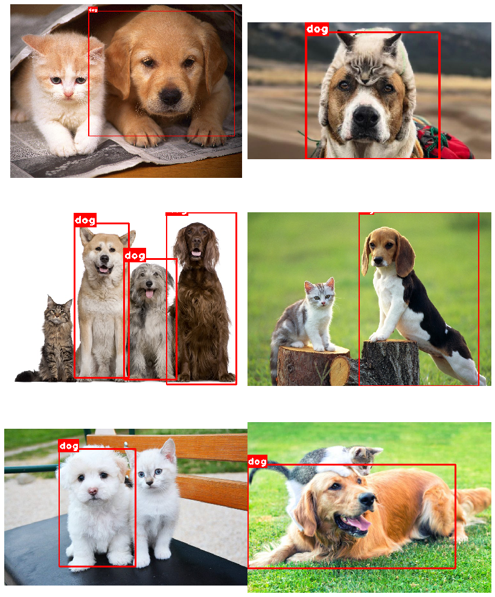
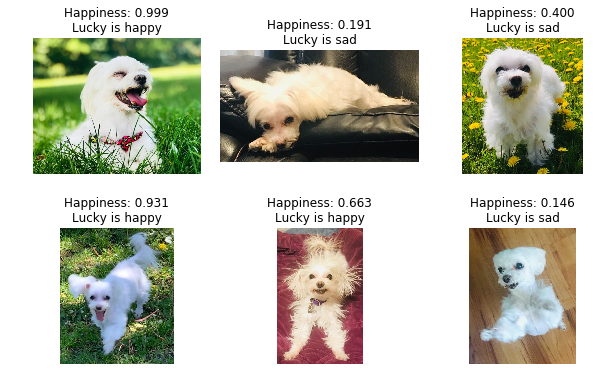

# Happy_Dog_Detection

This project aims to build a simple detector that localize and classify happy dogs in real-time!
Step by step model building processes are explored.
The best model is used to see if Lucky is happy or sad.

## Version 3 (Ongoing)
Prebuilt YOLO model (sources: [darkflow](https://github.com/thtrieu/darkflow) and [YOLO](https://pjreddie.com/darknet/yolo/)) is being customized to localize dogs in the given image.
For this project, the pretrained weights are being used, but in the next version, new weights is planned to be trained to improve the accuracy of the target detection.
Nonetheless, the **HappyDogClassifier** built in Version 2 will be integrated to this detection model to achieve the final goal of the project.

***Current DogDetector _without Happy_Dog_Classifier_V2_***

## Version 2
The model from version 1 suffered from overfitting.
The model has been improved by making the structure less complex and by adding more data augmentation.

### Hyperparam search
Hyperparameters (especially lr and batch size) were searched for small epochs to optimize the model.

### Model learning curve
The model seems to handle overfitting issue much better compared to the previous version.
It exhibits a much-improved accuracy of **~ 90%** on the test set.

### Mistakes by the model
Some wrongly labelled test set images were visualized to track down the ~ 10% error.

### Test on Lucky
The model predictions are well aligned with my intuition.

## Version 1

Various resnet-like custom models and Resnet50 transfer-learned model have been tested. 
In general, models could achieve ~ 80% accuracy on the test set when tuned properly. 
Its relatively low accuracy may be due to the small number of samples (~700 images for each class). 
The dataset was obtained from online with minimal pre-processing steps, thus contain very high variance in the image features.

### Model learning curve
The model started to overfit after ~ 30 epochs of training. The best model was chosen from there by early stopping the learning.

### Test on Lucky
Somewhat agreeable results. 

