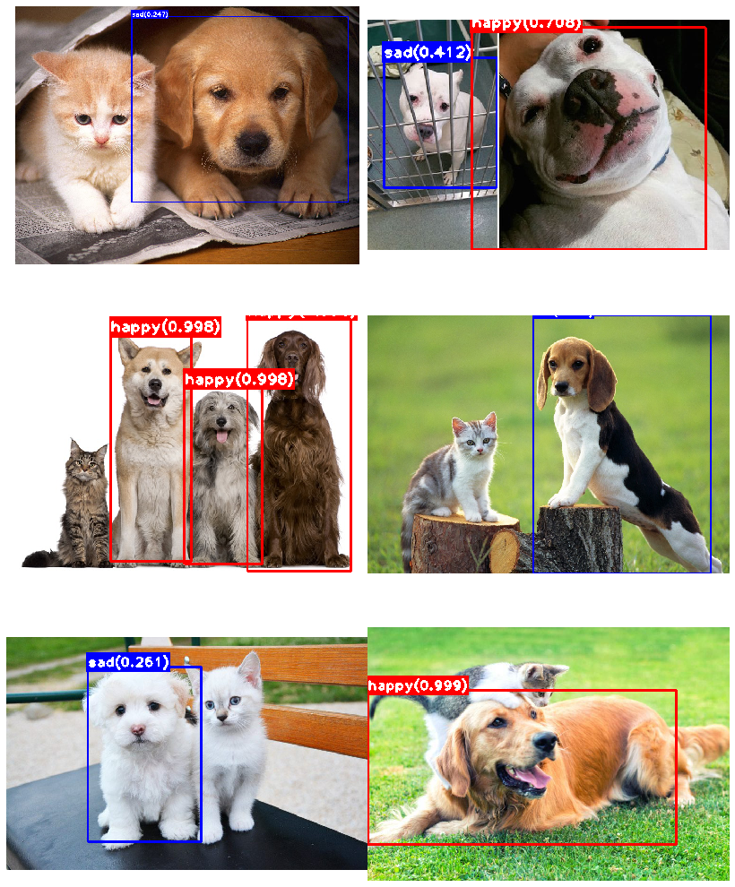
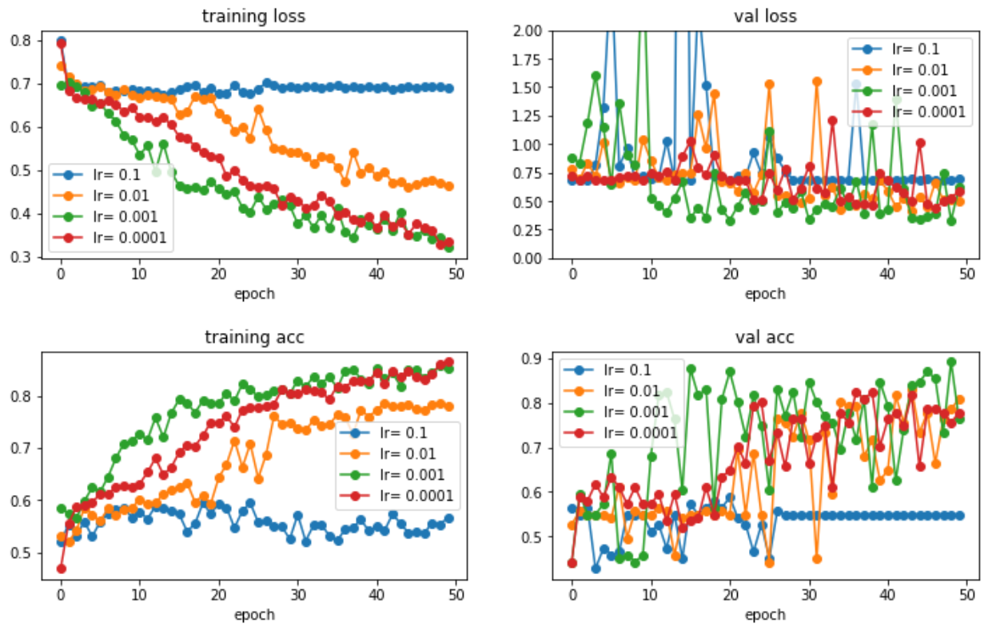
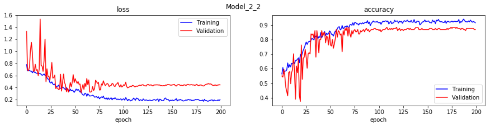
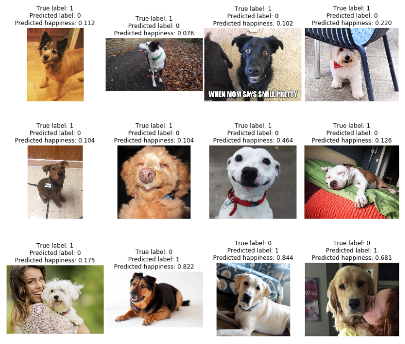
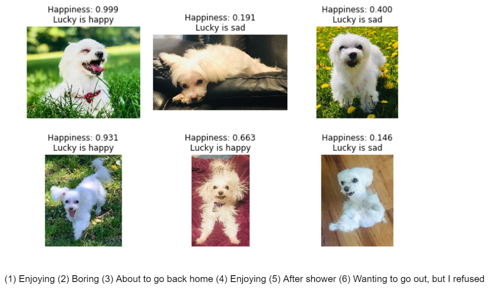
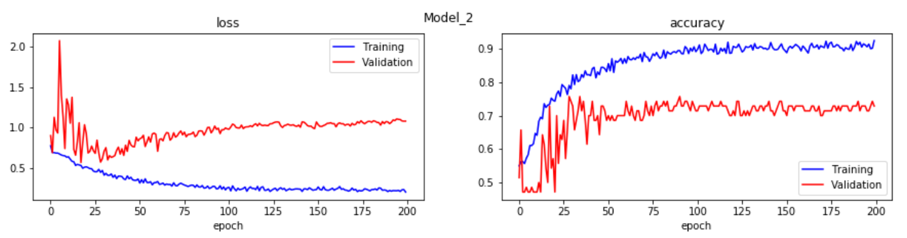

# Happy_Dog_Detection

This project aims to build an image detector that localize and classify happy dogs in real-time!
Step by step model building processes are explored in this project.
The best model is used to see if Lucky is happy or sad.

## [HappyDogDetector Version 1 (HDD_v1)][3]
Prebuilt YOLO model (sources: [darkflow](https://github.com/thtrieu/darkflow) and [YOLO](https://pjreddie.com/darknet/yolo/)) is being customized to localize happy dogs in the given image.
The **best model from hdc_v2** was successfully integrated to the customized YOLO detection model to localize/classify HappyDogs from the given images/videos.

### Running on a video (detecting only Happy)
*Video source: [here](https://www.youtube.com/watch?v=0lEUiQEDUHM)*

### Running on images (detecting both Happy and Sad)

### Upcoming for HDD_v2
* New weights are planned to be trained only to localize a face of a dog to improve the accuracy of the model.
* Will be implemented to a real-time module. 

## [HappyDogClassifier Version 2 (HDC_v2)][2]
The model from HDC_v1 suffered from overfitting.
The model has been improved by making the structure less complex and by adding more data augmentation.

### Hyperparam search
Hyperparameters (especially lr and batch size) were searched for small epochs to optimize the model.

### Model learning curve
The model seems to handle overfitting issue much better compared to the previous version. It exhibits a much-improved accuracy of **~** **90%** on the test set.

### Mistakes by the model
Some wrongly labelled test set images were visualized to track down the ~ 10% error.

### Test on Lucky
The model predictions are well aligned with my intuition.

## [HappyDogClassifier Version 1 (HDC_v1)][1]

Various resnet-like custom models and Resnet50 transfer-learned model have been tested. 
In general, models could achieve ~ 80% accuracy on the test set when tuned properly. 
Its relatively low accuracy may be due to the small number of samples (~700 images for each class). 
The dataset was obtained from online with minimal pre-processing steps, thus contain very high variance in the image features.

### Model learning curve
The model started to overfit after ~ 30 epochs of training. The best model was chosen from there by early stopping the learning.

### Test on Lucky
Somewhat agreeable results. 

[1]: https://github.com/sungsujaing/Happy_Dog_Detection/blob/master/HappyDogClassifier_v1.ipynb
[2]: https://github.com/sungsujaing/Happy_Dog_Detection/blob/master/HappyDogClassifier_v2.ipynb
[3]: https://github.com/sungsujaing/Happy_Dog_Detection/blob/master/custom_darkflow/HappyDogDetector_v1.ipynb
