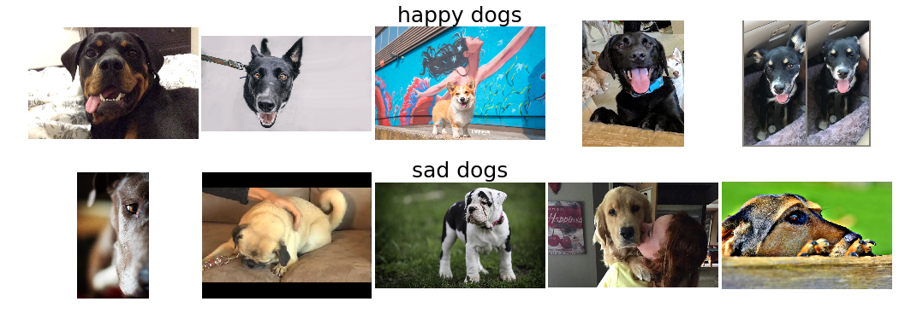
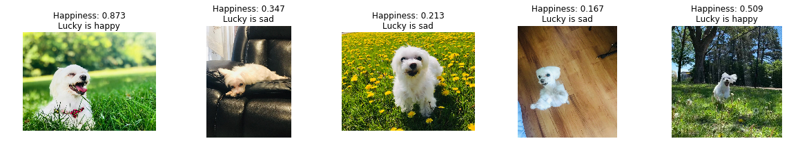

# Smiling_Dog_Detection

This project aims to build a simple image classifier that differentiate happy dogs from sad dogs.
Step by step model building processes are explored.
The best model is used to see if Lucky is happy or sad.

## Version 1

Various resnet-like custom models and Resnet50 transfer-learned model have been tested. 
In general, models could achieve ~80% accuracy on the test set when tuned properly. 
Its relatively low accuracy may be due to the small number of samples (~700 images for each class). 
The dataset was obtained from online with minimal pre-processing steps, thus contain very high variance in the image features.

### Example of training images

### Test on Lucky

